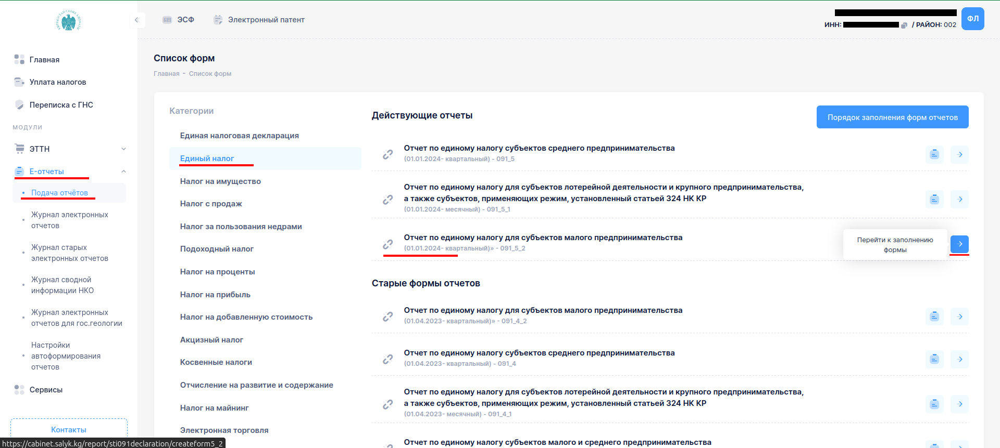
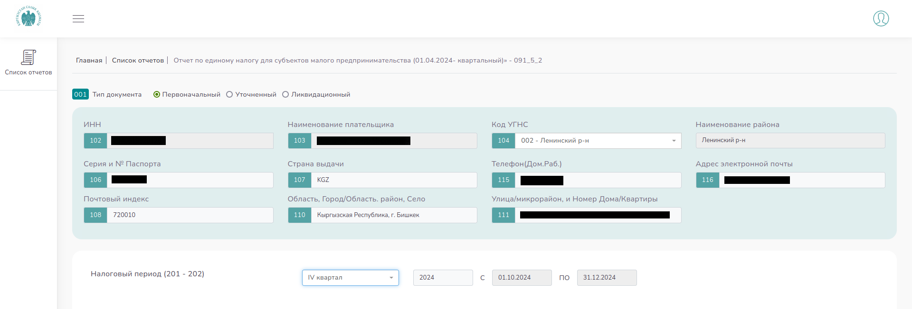
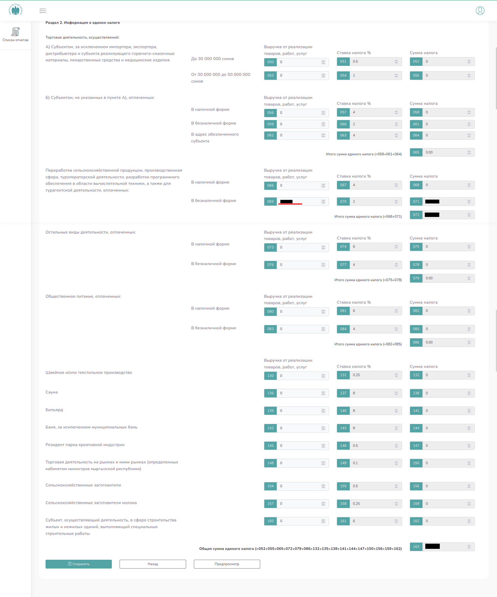
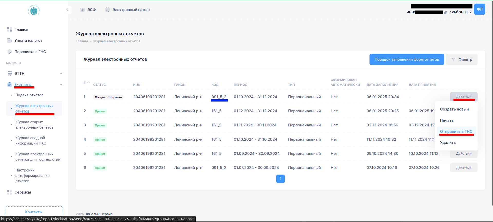
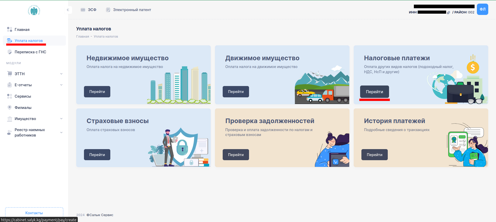
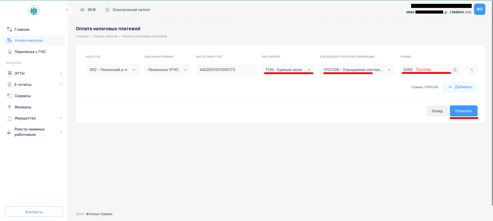
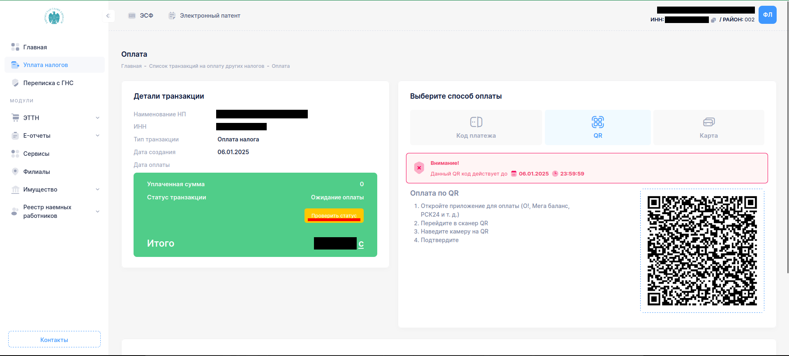

# Инструкция для заполнения и представления отчета по единому налогу для субъектов малого предпринимательства (091_5_2) и оплате

**Необходимо авторизоваться на сайте [cabinet.salyk.kg](https://cabinet.salyk.kg)**

## Шаг 1: Выбираете раздел “E-отчеты” –> Подача отчетов -> Единый налог -> Раздел "Действующие отчеты"

**Отчет по единому налогу для субъектов малого предпринимательства** (091_5_2). Нажимаете на кнопку "Перейти к заполнению формы"

## Шаг 2: По форме заполняете все ваши данные,  выбираете соответсвующий квартал

## Шаг 3: Сумма налога

Переходите в раздел 2 и подраздел с описанием:
> Переработка сельскохозяйственной продукции, производственная сфера, туроператорской деятельности, **разработки программного обеспечения** в области вычислительной техники, а также для турагентской деятельности, оплаченных: 
В ячейке 069 указываете общую сумму выручки за 3 месяца (за отчетный период).
Сумма налога высчитывается автоматически (по формуле). Нажимаете сохранить.

## Шаг 4: Проверяете в Журнале электронных счетов -> Действия -> Отправить в ГНС

## Шаг 5: Для оплаты переходите в Уплаты налогов -> Налоговые платежи 

## Шаг 6: Заполняете -> Вид налога -> 1130 единый налог -> указываете сумму и нажмите оплатить.

## Шаг 7:
Отобразится окно, с Qr кодом или кодом платежа (на выбор) через BakAi проводите платеж. После проверьте статус. 

P.S Есть и другие способы оплаты единого налога. 
