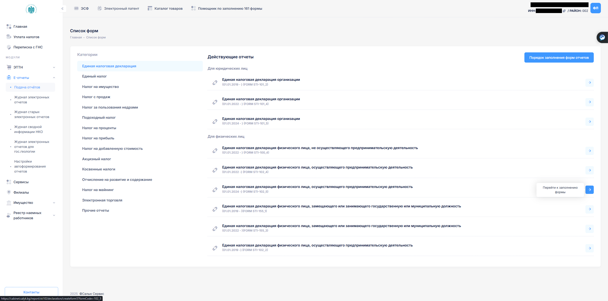
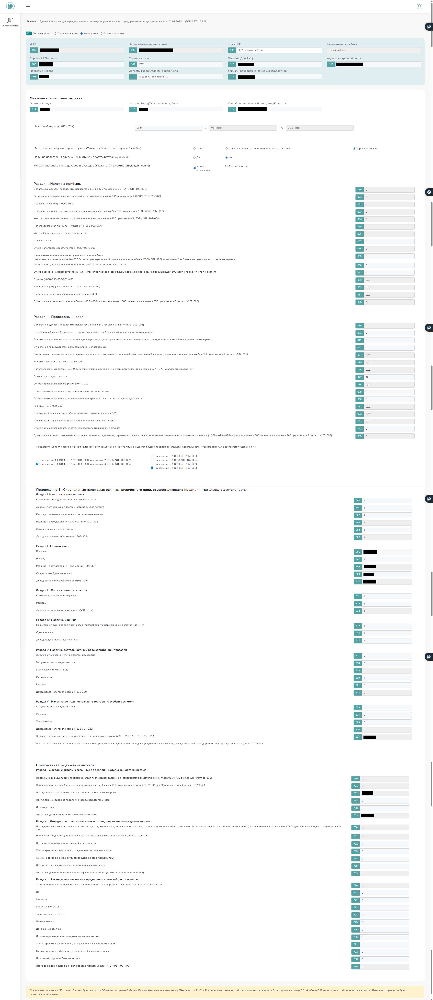

# Инструкция по заполнению ЕНД STI(102_5)

>⚠ Ремарка: Все нижеописанные шаги были проделаны мной согласно моему уразумению (как я понял).

**Необходимо авторизоваться на сайте [cabinet.salyk.kg](https://cabinet.salyk.kg)**

## Шаг 1 Е-отчеты -> Подача отчетов -> Единая налоговая декларация -> FORM STI 102_5

## Шаг 2 Заполнение Приложения 3 и проверка отображения в Приложении 8
> Если были расходы связанные именно с вашей деятельностью ИП и у вас сохранились чеки либо какое друо доказательство того что расход на ваше ИП то и указываете в части расходов. (И надо наверное этот расход оплачивать с бизнес карты, чтобы и оттуда прослеживать.)

# ГНС документы
Вы также можете ознакомиться с более полной информацией по заполнению ЕНД по этим документам:

[ПОРЯДОК заполнения и представления Единой налоговой декларации физического лица, осуществляющего предпринимательскую деятельность (FORMSTI-102)](https://sti.gov.kg/stsStorage/websti/2024/12/30/stidocument_174127e1-b26a-4639-a0fc-317f86e4d275.pdf)
[Пример заполнения](https://sti.gov.kg/stsStorage/websti/2025/1/16/stidocument_1976dcf3-ebd5-4ac3-b71b-c5def4d75cd1.pdf)
