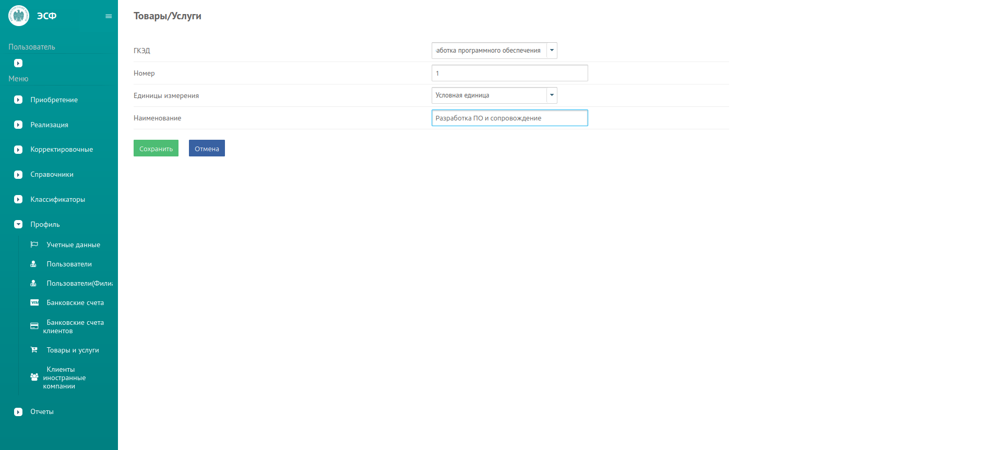
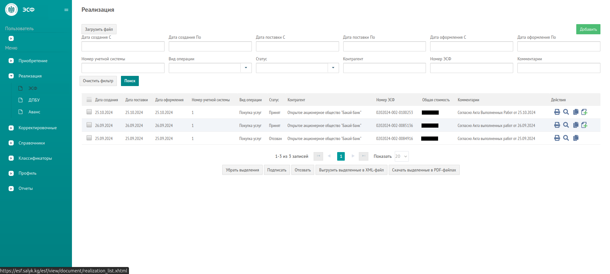
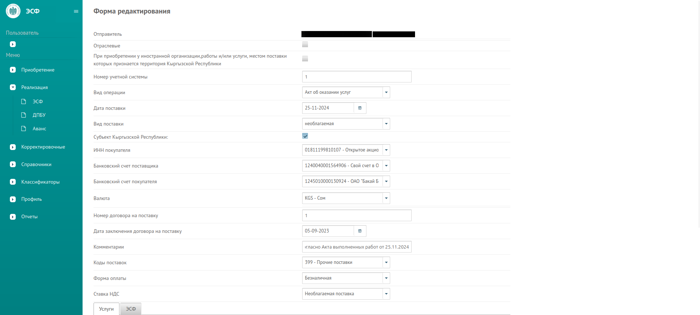
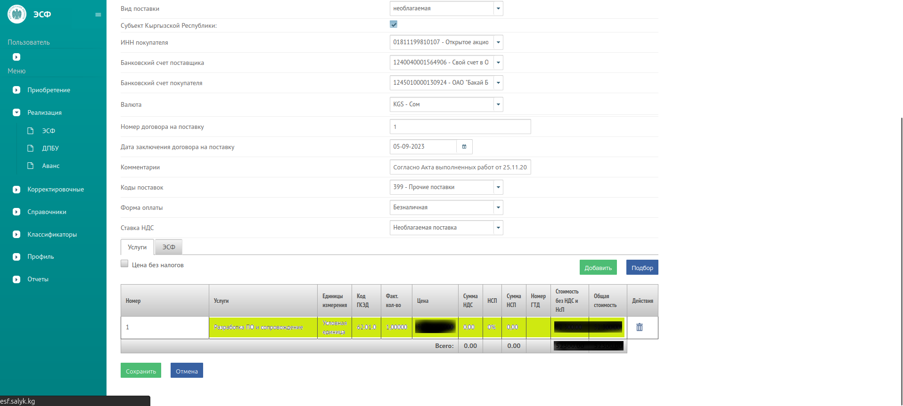
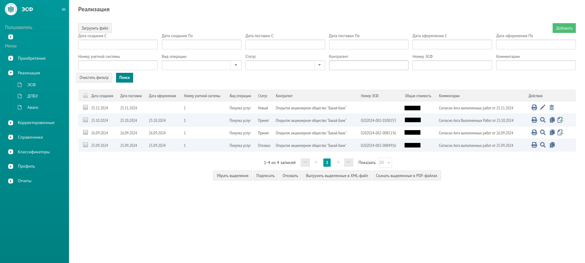
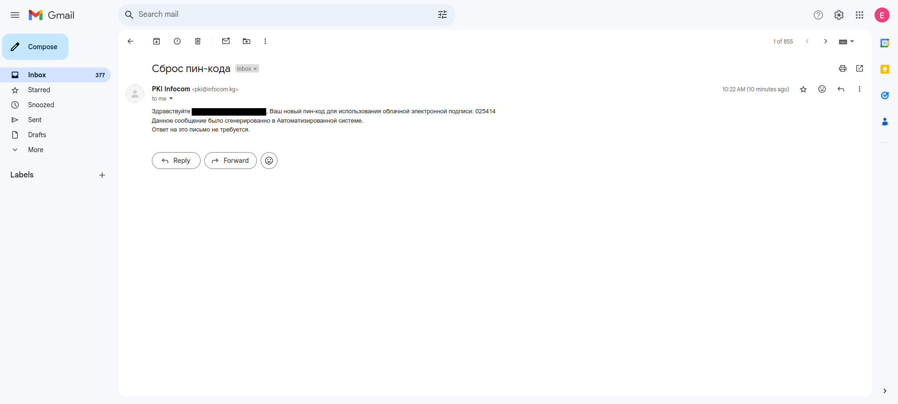

# Первичные настройки профиля в <a href="https://esf.salyk.kg" target="_blank">esf.salyk.kg</a>

## Шаг 1: Указываете свой ИП счет (куда поступает ЗП)
- В sidebar menu слева нажимаете на Профиль -> Банковские счета.
- Необходимо указать ваши данные Банковского счета ИП и наименование понятное для вас самих.

Увидете сразу страницу заполнения банковского счета в первый раз.

После заполнения своих данных в последуюшем вы будете видеть список своих банковских счетов.

## Шаг 2: Банковский счет клиента (работадателя): `1245010000130924`
- В sidebar menu слева нажимаете на Профиль -> Банковские счета клиентов.
- Укажите как указано на картинке.

Для первого раза лучше сразу добавить банковский счет банка

В дальнейшем после того как пройдете а раздел банковских счетов то вы увидете список указанных вами банковских счетов.

## Шаг 3: Раздел товаров и услуг
- В sidebar menu слева нажимаете на Профиль -> Товары и услуги.
- Укажите как указано на картинке.

Необходимо добавить товар или услугу для указания в счет фактуре далее.

В дальнейшем при открытии данного раздела то вы будете видеть такой список ваших товаров и услуг.

Вышеуказаныне шаги необходимы при первом заполнении, в дальнейшем пройденные выше шаги будут доступны при заполнении ЭСФ.

# Формирование и подпись ЭСФ

## Шаг 1: Добавление ЭСФ

- В sidebar menu слева нажимаете на Реализация -> ЭСФ.
- Нажимаете справа сверху на кнопку Добавить.

## Шаг 2: Заполнение ЭСФ

- Заполните как указано на картинках

- После сохранения файла вас перенесет на список ваших ЭСФ.

Вы можете заметить что нет номера ЭСФ и надо подписать вашу счет-фактуру.

## Шаг 3: Подписание ЭСФ
- Далее нажимаете на кнопку подписать.
- Для того чтобы подписать нужно предоставить пин код отправленный на вашу почту от infocom.

- Вставьте код из письма.

## Шаг 4: Проверка статуса ЭСФ

- Далее проверьте статус и сформировался ли номер ЭСФ.

# Ошибки и решения

## Вход через QR в ЕСИА
В случае если при попытке подписать выходит такая ошибка:

Надо в пордал Түндүк войти при помощи **электронной подписи** введя ИНН и пароль. В таком случае сможете подписать и отправить ЭСФ.
