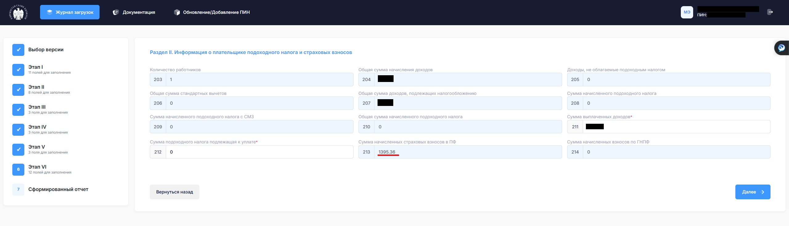

# Инструкция для формирования отчета по соц фонду 2025 (по подоходному налогу, отчислениям по гос. социальному страхованию FORM STI-161)
С 5 марта 2025 года обновили методику отчета и убрали возможность выгрузки xml файла.

## Шаг 1 Выбираете раздел E-отчеты -> Подача отчетов -> Подоходный налог
Можно заметить что сверху есть две ссылки на `каталог товаров` и `помошник по заполнению 161`. 
В новой версии нет отдельной ссылки для загрузки XML файла а есть в двух местах ссылка перенаправляющая в новый помошник по заполнению 161 формы.

## Шаг 2 Выбираете версию формы согласно периоду действия отчетности

## Шаг 3 Заполнение Этапа I

## Шаг 4 Заполнение Этапа II

## Шаг 5 Заполнение Этапа III (Модалка по работникам)

В моем случае этапы IV и V не актуальны ввиду чего в данной инструкции эта часть не будет отображена.

## Шаг 6 Заполнение Этапа VI
В новой версии 211 поле автоматически подставляет сумму дохода, ранее такого не было. (Уточнить надо у ГНС, после обращения к тех поддержке мне сказали что надо спросить у налоговой)

## Шаг 7 Сформированный отчет 

## Шаг 8 Выбор метода отправки
Выбираете согласно вашей ситуации.

## Шаг 9 Проверка статусов отправки

---

# Ошибки встреченные мной и их решение
## Поле 253: Не найдена привязка страховых взносов к категории работников - 103
Согласно рекомендации выданной мне Техподдержкой ГУ "Салык Сервис" если у вас такая ошибка:

Мне посоветовали сменить вид тарифа страховых взносов с ФЛСВ на СПИНО (Надо еще выяснить такие танцы с бубном вообще были ли в компетенции техподдержки на момент запроса информации)

### Шаг 1 Переписка с ГНС -> Подача заявлений

### Шаг 2 Раздел Заявления
У меня до того как сменить тариф было ФЛСВ (На след день даты ФЛСВ с момента открытия ИП 05 сентября 2024 были закрыты датой 7 декабря 2024. А СПИНО началось с 1 января 2025)

### Шаг 3 Подача на СПИНО
Ознакомьтесь со всем написанным и если вы не принадлежите к указанным группам то без галочки можете нажат на кнопку подачи заявления.

После смены тарифа с ФЛСВ на СПИНО у меня получилось сдать отчет 161_5 6 марта 2025 года.
