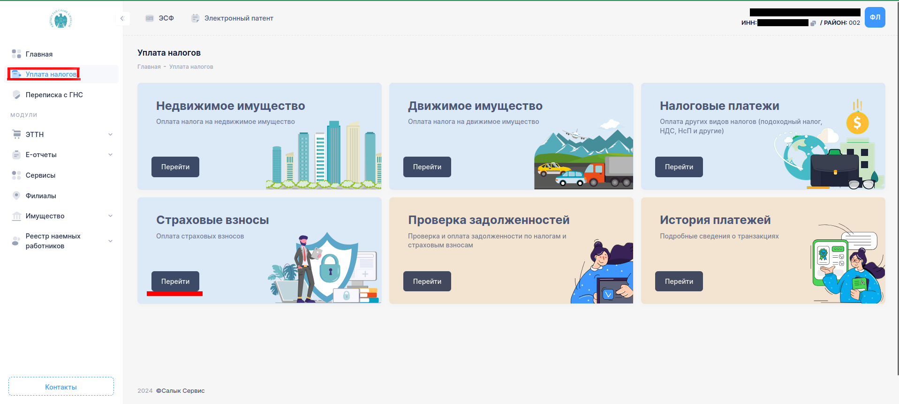
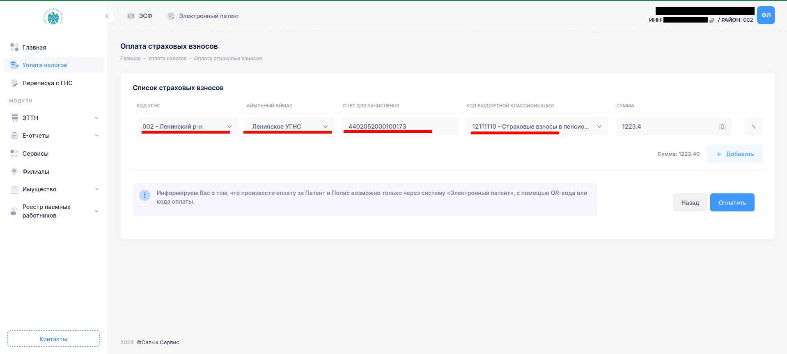
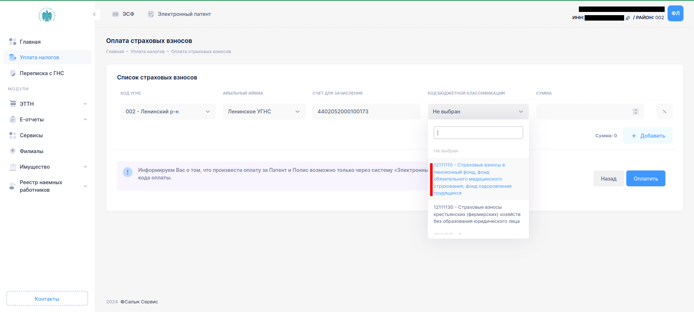
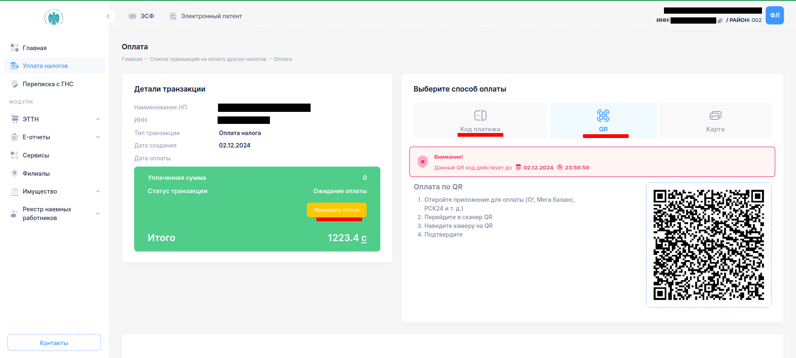
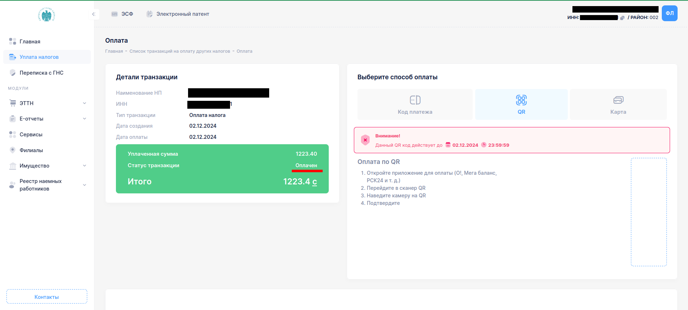

# Инструкция для формирования платежки по соц фонду и получения кода оплаты (QR)

**Необходимо авторизоваться на сайте [cabinet.salyk.kg](https://cabinet.salyk.kg)**

## Шаг 1: Выбираете раздел “Уплата налогов”, далее открываете “Страховые взносы”
Как указано на картинке

## Шаг 2: Заполнить все поля в “Список страховых взсносов”

Код бюджетной классификации – `12111110`, сумма - `1223,40` сом (для г. Бишкек, для других регионов сумма может отличаться, зависит от суммы МРД), далее при нажатии оплатить выйдет Код платежа и Qr код.

## Шаг 3: Произвести оплату через Qr код, либо по Коду платежа в интернет-банкинге, моб кошельке.

После оплаты не забудьте проверить статус оплаты.

Сумма страховых взносов согласно годам:
- 2024 - `1223.4` сом
- 2025 - `1395.36` сом

> P.S. Если ежемесячный отчет по соц фонду уже сдан, то сформировать платежку также можно  во вкладке “Проверка задолженности – Страховые задолженности”. 
