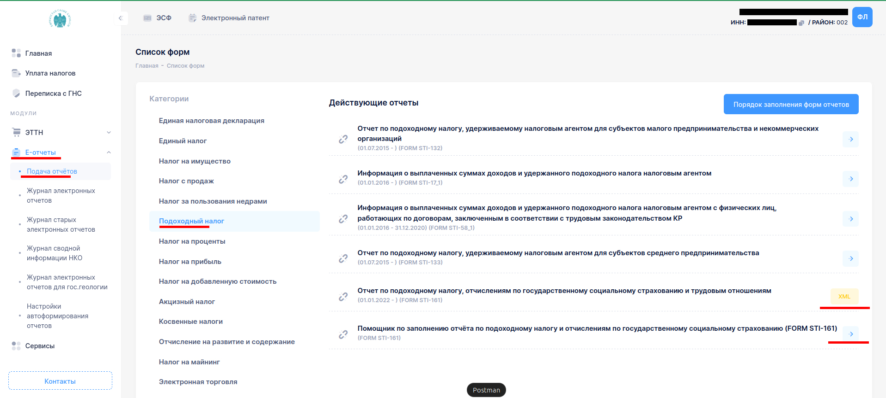
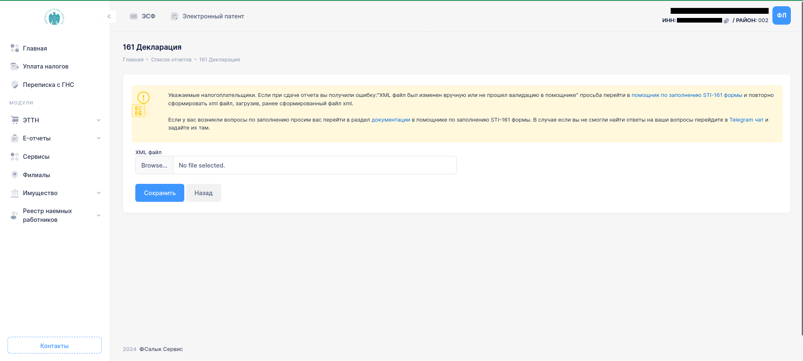
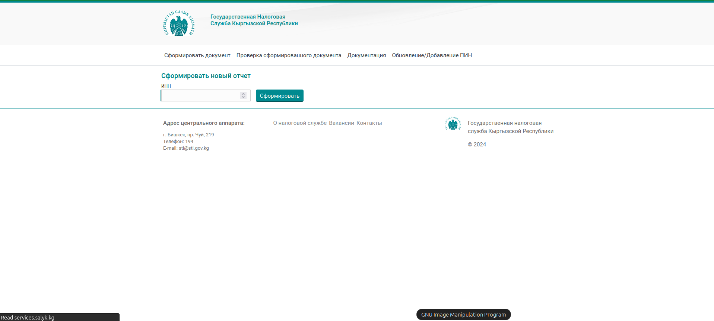
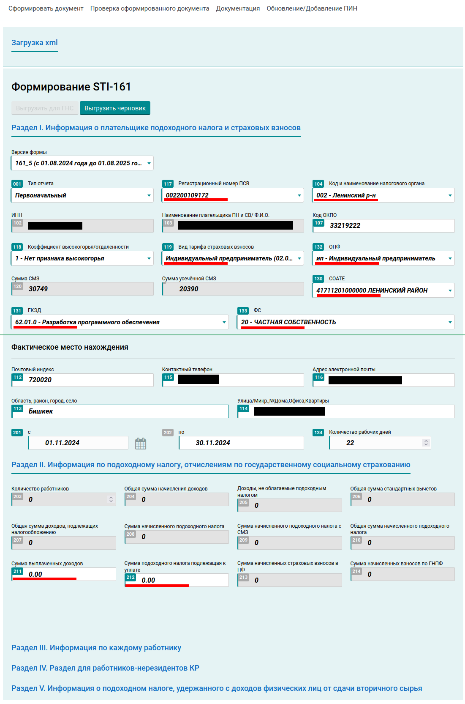
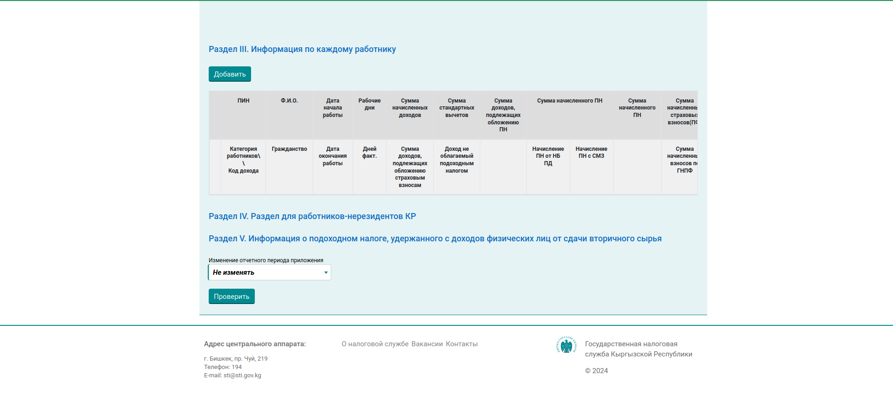
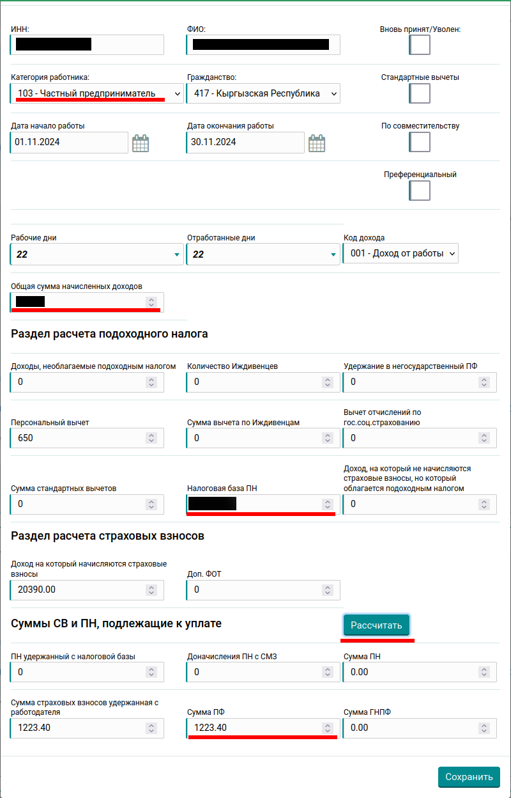
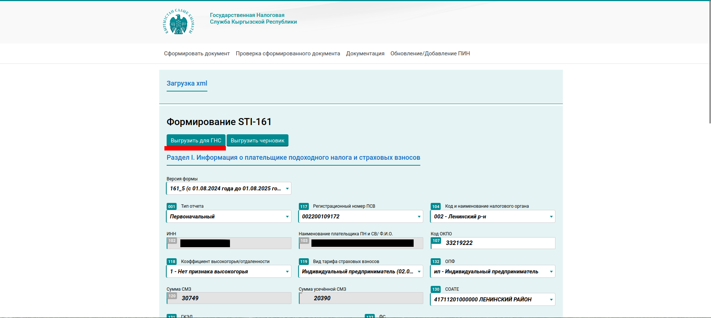
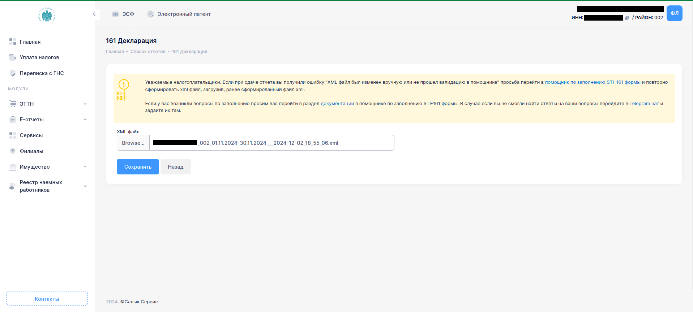
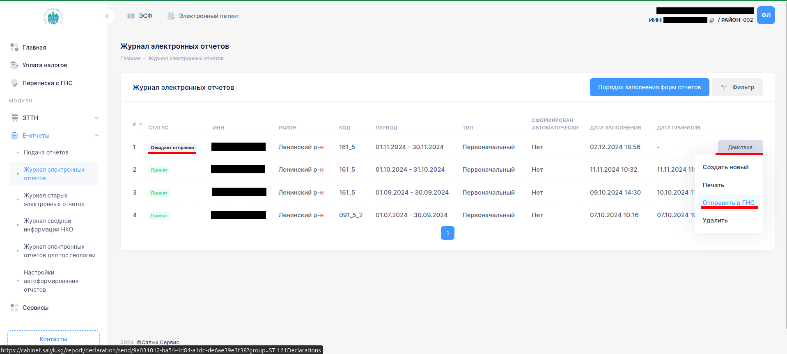

# Инструкция для формирования отчета по соц фонду (по подоходному налогу, отчислениям по гос. социальному страхованию FORM STI-161)

**Необходимо авторизоваться на сайте cabinet.salyk.kg.**

## Шаг 1: Выбираете раздел E-отчеты -> Подача отчетов -> Подоходный налог

**Опционально:** В новой вкладке для последующей загрузки отчета можете открыть (FORM STI-161 - XML)

По кликабельной ссылке «помощник по заполнению отчета STI-161 формы». Вводите свой ИНН (Идентификационный номер налогоплательщика) и нажимаете «Сформировать документ»

## Шаг 2: Раздел I. Заполняете все помеченные поля
Обратите внимание на пункты **119**, **130**, **131**, **132**, **133**, **134** - (зависит от кол-ва рабочих дней отчетного месяца, согласно произв. календарю).
Пункты **211** и **212** оставляете 0.

>**Расшифровка полей Раздела I:**
> 1. Сумма СМЗ - Среднемесячная заработная плата по району по учетной регистрации плательщика указанная в поле “Код и наименование налогового органа”
> 2. Сумма МРД - минимальный расчетный доход по р-ну по учетной регистрации плательщика
> 3. СОАТЕ - Государственный классификатор системы обозначений объектов административно-территориальных и территориальных единиц  КР
> 4. ГКЭД - Государственный классификатор экономической деятельности
> 5. ОПФ - Организационно правовая Форма
> 6. ФС - Форма собственности

## Шаг 3: Открываете Раздел III Информация по каждому работнику, нажмите кнопку «Добавить»

## Шаг 3.1: Заполняете все пункты
Категория работника – **103 Частный предприниматель**, 
Стандартные вычеты - галочку **не ставим**, 
Общая сумма начисленных доходов - указываете свою сумму доходов и нажимаете «Рассчитать».

Проверьте правильность заполненных данных, затем нажмите на кнопку “Сохранить”. 

## Шаг 4: Выгрузка XML файла
После заполнения всех обязательных полей нажмите на кнопку “Проверить”, если все корректно, поднимаетесь вверх и нажимаете «Выгрузить для ГНС».
XML  файл нельзя редактировать.

## Шаг 4.1: Загрузка XML файла
Открываете ранее открытую вкладку Отчет FORM STI-161 - XML, загружаете файл, сохранить и отправить в ГНС.

## Шаг 5: Отправка в ГНС
В разделе "Журнал электронных отчетов" проверяете статус отправки отчета в ГНС. Если документ ожидает отправки то через кнопку действия справа меняете статус на "Отправить в ГНС".

Статус должен поменяться на "В обработке"
